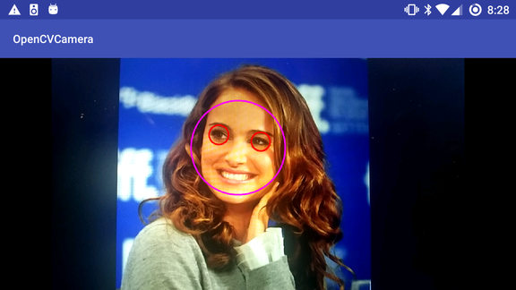
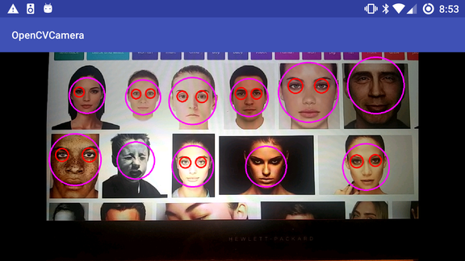

# Face detection Android application
Various face detection implementations using OpenCV. 
You can download this and try it out on your own Android phone (if you have the correct CPU architecture).

### Tools:
Created in Android Studio 3.0.1 using OpenCV 2.4. Used both the Android SDK (Java) and NDK (native C++ code). 

### Screenshots:
Single face detection

Multiface detection

